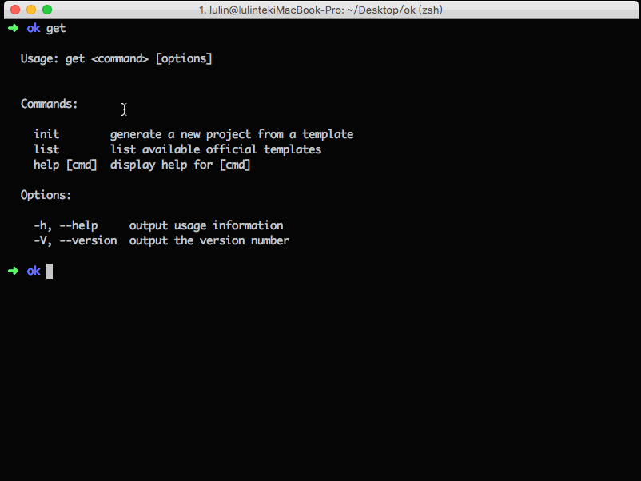

### 一个命令工具

完整用法可以使用：

    // 查看基本的帮助
    get --help
    // 可以查看 init 命令的用法
    get init
    // 查看可以用的所有模板
    get list

#### 用法一

    get init <templateName> <yourFolder>

#### 用法二

    get init <username/repo> <yourFolder>

